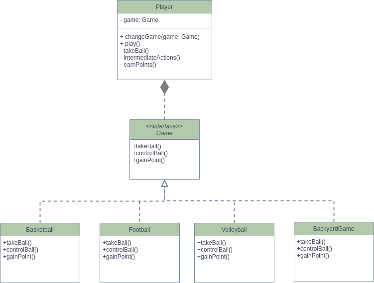

:author: Magdalena Żaba
:icons: font

= Strategy Workshops

This workshops present how Strategy design pattern cacn be implemented do reduce code duplicity and prevent your code from breaking Open/Close principle from SOLID

== General info

The task concerns the type class _Player.java_:

. observe code duplications in the original code (ask yourself a question: _How many changes I need to make in that code in order to add a new game?_)
. implement below class diagram to introduce Strategy design pattern

.Class diagram

== Technologies

* Java 15
* Maven 4

====
TIP: Remember that you are refactoring existing code. Don't change the functionality.

====

== Sources:

. [https://en.wikipedia.org/wiki/Strategy_pattern]
. [https://refactoring.guru/design-patterns/strategy]

